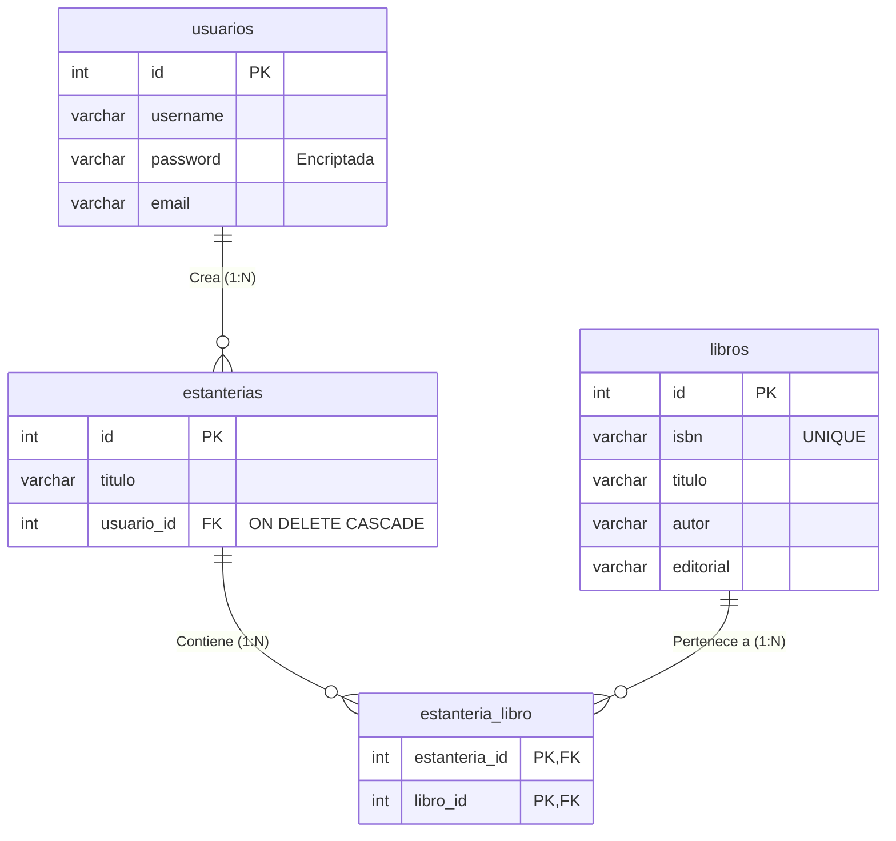

# 🗄️ Diseño de la Base de Datos (`biblioteca_db`)

El sistema utiliza una base de datos relacional (MySQL) para gestionar los usuarios, sus estanterías personalizadas y el catálogo global de libros.

## 🗺️ Diagrama Entidad-Relación (ER)

---

## 📋 Diccionario de Datos

### 1. Tabla `usuarios`
Almacena la información de autenticación de las personas que utilizan la aplicación.
* **`id`**: (INT, PK, Auto Incremental) Identificador único del usuario.
* **`username`**: (VARCHAR 50, UNIQUE) Nombre de usuario para iniciar sesión.
* **`password`**: (VARCHAR 255) Contraseña del usuario (se recomienda almacenar encriptada con `password_hash`).
* **`email`**: (VARCHAR 100, UNIQUE) Correo electrónico de contacto/recuperación.

### 2. Tabla `libros`
Catálogo global de libros. Un mismo libro físico/lógico se registra una sola vez en el sistema, sin importar cuántos usuarios lo tengan en sus estanterías.
* **`id`**: (INT, PK, Auto Incremental) Identificador interno del libro en la BD.
* **`isbn`**: (VARCHAR 50, UNIQUE) Código internacional estándar del libro. Evita duplicados.
* **`titulo`**: (VARCHAR 255) Título de la obra.
* **`autor`**: (VARCHAR 255) Nombre del creador de la obra.
* **`editorial`**: (VARCHAR 255) Casa editora.

### 3. Tabla `estanterias`
Representa las listas o "librerías" personalizadas creadas por un usuario (ej. "Favoritos", "Por leer", "Sci-Fi").
* **`id`**: (INT, PK, Auto Incremental) Identificador único de la estantería.
* **`titulo`**: (VARCHAR 255) Nombre que el usuario le dio a la estantería.
* **`usuario_id`**: (INT, FK) Llave foránea hacia `usuarios(id)`. 
  * *Relación:* Si se elimina al usuario, se eliminan en cascada sus estanterías (`ON DELETE CASCADE`).

### 4. Tabla `estanteria_libro` (Tabla Pivote)
Implementa la relación **Muchos-a-Muchos** entre `estanterias` y `libros`. Permite que una estantería tenga muchos libros, y que un libro esté en muchas estanterías (de distintos usuarios).
* **`estanteria_id`**: (INT, PK, FK) Referencia a la estantería.
* **`libro_id`**: (INT, PK, FK) Referencia al catálogo de libros.
  * *Restricción:* La llave primaria es compuesta (`estanteria_id`, `libro_id`), lo que garantiza que un mismo libro **no se pueda agregar dos veces a la misma estantería**.
  * *Relación:* Si se elimina la estantería o el libro del sistema global, este registro desaparece automáticamente (`ON DELETE CASCADE`).

---

## ⚙️ Reglas de Negocio Implementadas en la BD
1. **No hay libros repetidos:** El campo `isbn` en la tabla `libros` es `UNIQUE`. Al intentar guardar el mismo ISBN dos veces, el motor SQL arrojará un error `23000` (Duplicate entry).
2. **No hay duplicidad en estanterías:** Gracias a la llave primaria compuesta en `estanteria_libro`, es imposible vincular el mismo libro a la misma estantería más de una vez.
3. **Limpieza automática (Cascade):** Si un administrador borra un `usuario` de la tabla, todas sus `estanterias` y las relaciones de los libros en esas estanterías (`estanteria_libro`) se borran solas para no dejar basura en la BD.
